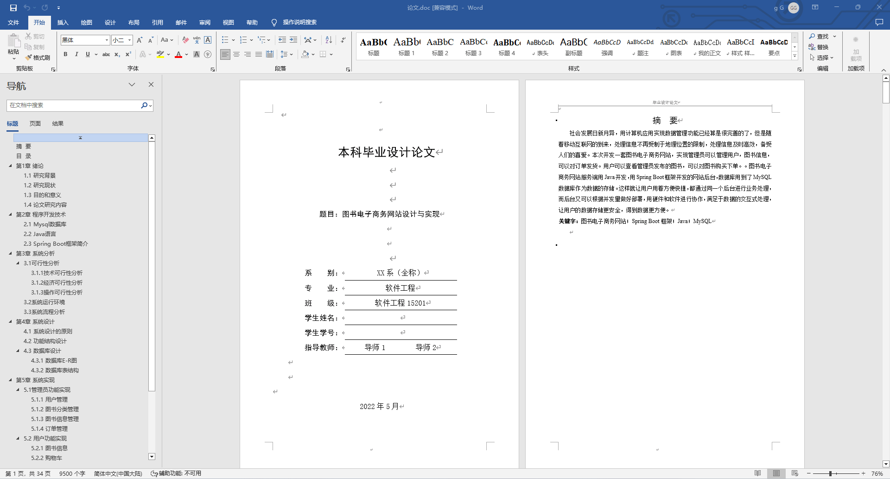
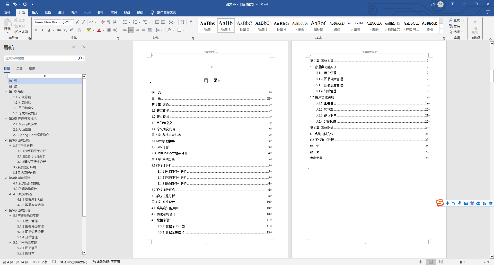
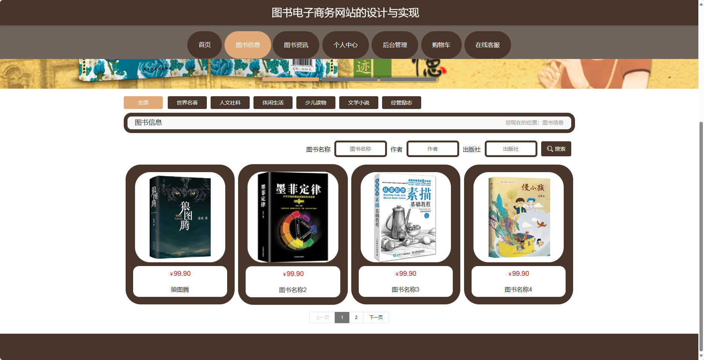
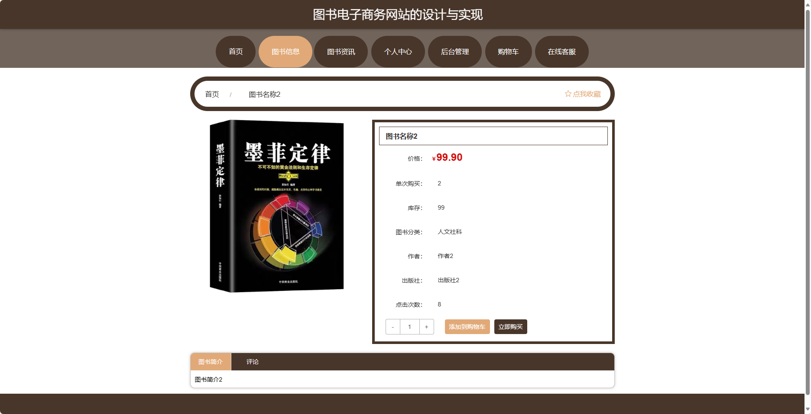
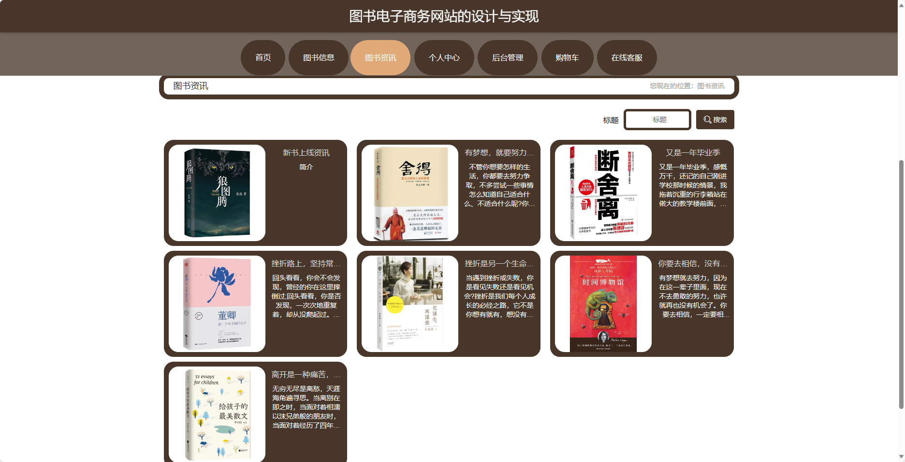
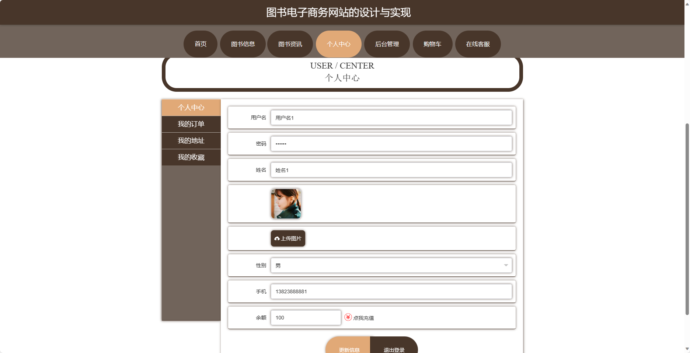
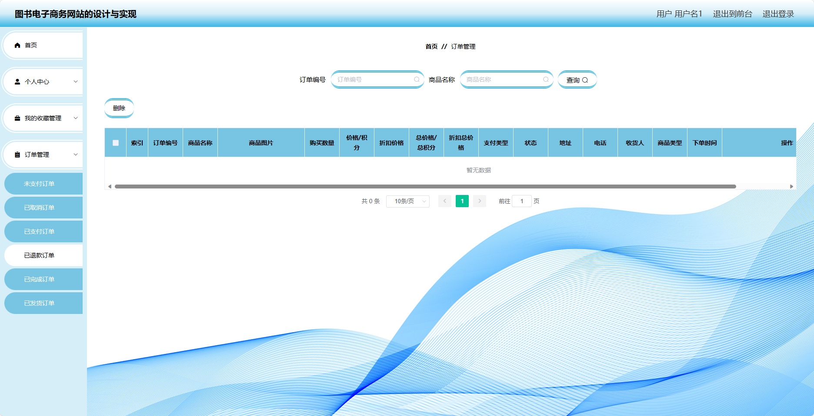
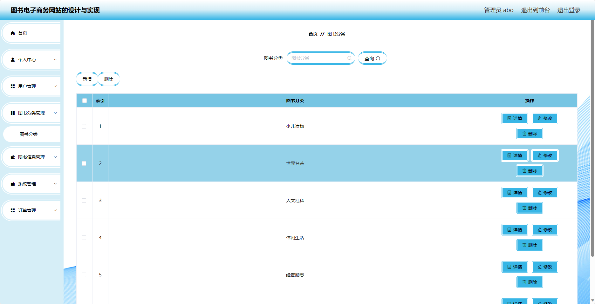
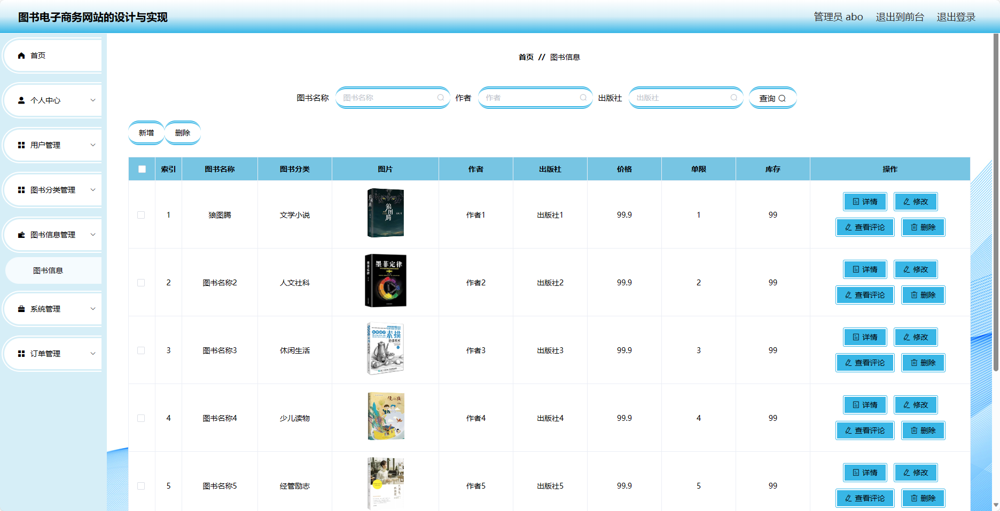

基于SpringBoot的图书电子商务网站（程序+论文）
=
- 完整代码获取地址：从戎源码网 ([https://armycodes.com/](https://armycodes.com/))
- 作者微信：19941326836  QQ：952045282 
- 承接计算机毕业设计、Java毕业设计、Python毕业设计、深度学习、机器学习
- 选题+开题报告+任务书+程序定制+安装调试+论文+答辩ppt 一条龙服务
- 所有选题地址https://github.com/nature924/allProject

一、项目介绍
---
基于Spring Boot框架实现的图书电子商务网站，系统包含两种角色：管理员、用户,系统分为前台和后台两大模块，主要功能如下。
### 前台：
- 首页：展示图书电子商务网站的主页信息。
- 图书信息：浏览图书的详细信息，包括图书封面、作者、价格等。
- 图书资讯：查看最新的图书相关资讯。
- 个人中心：管理个人信息，包括修改个人资料、查看订单等。
- 购物车：管理已选购的图书，包括添加、删除、修改数量等操作。
- 在线客服：提供在线客服支持。

### 后台：

### 管理员：
- 个人中心：管理个人信息。
- 用户管理：管理用户的信息，包括查看用户列表、禁用用户等。
- 图书分类管理：管理图书的分类信息，包括添加、编辑、删除分类。
- 图书信息管理：管理图书的信息，包括添加、编辑、删除图书。
- 系统管理：管理系统的基础数据，如图书标签、出版社等。
- 订单管理：查看和管理用户的订单信息，包括订单列表、订单详情等。

### 用户：
- 个人中心：管理个人信息。
- 我的收藏管理：管理用户收藏的图书信息，包括添加、删除收藏等操作。
- 订单管理：查看和管理用户的订单信息，包括订单列表、订单详情等。

二、项目技术
---
- 编程语言：Java
- 数据库：MySQL
- 项目管理工具：Maven
- 前端技术：VUE、HTML、Jquery、Bootstrap
- 后端技术：Spring、SpringMVC、MyBatis

三、运行环境
---
- 操作系统：Windows、macOS都可以
- JDK版本：JDK1.8以上都可以
- 开发工具：IDEA、Ecplise、Myecplise都可以
- 数据库: MySQL5.7以上都可以
- Tomcat：任意版本都可以
- Maven：任意版本都可以

四、运行截图
---
### 论文截图：

### 程序截图：

